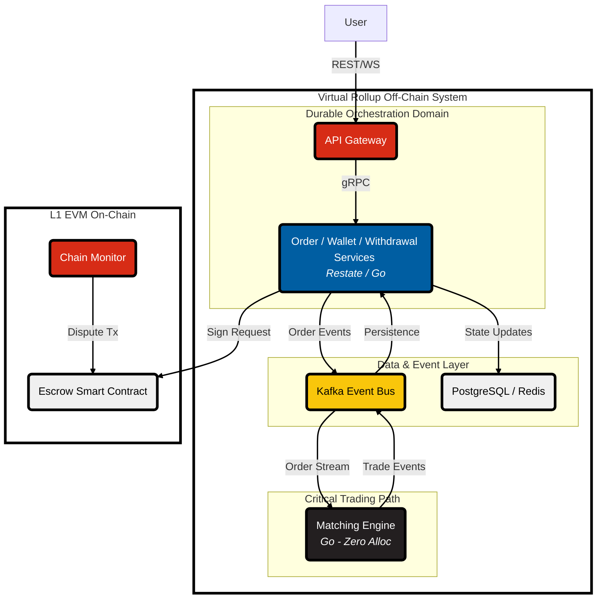

# Virtual Rollup System Architecture and Financial Core Blueprint

This document outlines the architectural blueprint and deep financial mechanics for a high-throughput decentralized perpetuals exchange built on a Virtual Rollup framework. Designed to achieve zero-gas instant finality, the system merges the sub-millisecond latency of centralized matching engines with the trust-minimized self-custody of Web3 state channels.

### The Virtual Rollup Mechanism

The core innovation of this architecture is the strict decoupling of **State** and **Escrow**. 

Instead of relying on global blockchain consensus for every trade, the system utilizes Zero Knowledge State Channels (ZKSC) to achieve Local Consensus. Users lock funds (Escrow) on a Layer 1 smart contract and receive a cryptographic balance (State). Trading occurs entirely off-chain via peer-to-peer state updates co-signed by the user and the exchange operator. This eliminates block latency and gas fees. The L1 smart contract acts solely as a dispute resolution layer and custodian of the locked escrow.

To support this mechanism, the off-chain operator backend enforces a strict separation of concerns into two operational latency domains:

1.  **The Critical Trading Path (<1ms Latency):** Optimized for raw speed and deterministic FIFO ordering. Comprises a **Kafka** event log and a highly-optimized, zero-allocation **Matching Engine (ME)** written in **Go**.
2.  **The Durable Orchestration Domain (10-50ms Latency):** Handles complex financial workflows where absolute correctness and fault tolerance are non-negotiable, such as locking margin in isolated vaults and aggregating MPC signatures for L1 settlement. This domain leverages **Restate** (Durable Execution) alongside Redis and PostgreSQL.

### Scale and Throughput

The architecture handles extreme market volatility through specific design choices addressing performance bottlenecks across microservices including the API Gateway, OMS, Matching Engine, Trade Execution, Wallet, Liquidation, and Signature Service.

*   **Matching Engine Performance:** To prevent latency spikes from Garbage Collection (GC), the Matching Engine core loop utilizes a zero-allocation fast path. Pre-allocated memory arenas and `sync.Pool` for object reuse effectively bypass the GC during critical matching operations to achieve predictable, sub-millisecond latency.
*   **Signature Service Throughput:** The cryptographic overhead of MPC-TSS (Multi-Party Computation Threshold Signature Scheme) ceremonies is optimized by batching multiple state signature requests into a single ceremony. The Signature Service pods are horizontally scaled to handle concurrent signing loads.
*   **Database Throughput:** To decouple the high-speed trading path from the persistence layer, the Trade Execution service consumes trades from Kafka and performs asynchronous bulk-writes to PostgreSQL. This amortizes the cost of I/O across many trades.
*   **Horizontal Scaling via Sharding:** 
    *   **Order Books:** Sharded by trading pair (e.g., `ETH-USD`). Each pair is assigned to a specific Kafka partition and a dedicated Matching Engine instance, isolating market activity.
    *   **Isolated Margin Vaults (IMVs):** User portfolios are sharded by a hash of the `user_id`. This distributes load across Redis Cluster for hot state (real-time margin checks) and partitioned PostgreSQL for persistent state.
*   **Strict Ordering Guarantees:** Strict FIFO ordering is enforced to ensure fair matching. This is achieved using the `market_id` as the Kafka partition key and configuring producers with `acks=all` and `max.in.flight.requests.per.connection=1` to prevent message reordering from network retries.
*   **System-wide Backpressure:** A multi-layered defense handles load spikes. The API Gateway implements token-bucket rate limiting. The Order Management Service monitors Kafka producer buffer metrics; if the buffer exceeds 80%, it sheds load by explicitly prioritizing cancel orders over new orders to protect users during flash crashes.

### Reliability and Financial Correctness

The internal ledger must remain perfectly consistent and recover gracefully from infrastructure failures.

*   **System Invariants:** Financial health is defined by a continuously asserted core invariant: `Total L1 Escrow == Sum(Off-Chain IMV Balances) + Global Insurance Pool`. A background service reconciles this every 60 seconds, automatically halting L1 withdrawals and triggering critical alerts on any violation.
*   **Durable Orchestration (Idempotency and Reverts):** Handling distributed state failures robustly is achieved via **Restate**. The `placeOrder` process operates as a durable, stateful workflow:
    1.  The OMS initiates a Restate-managed workflow for the order.
    2.  The workflow makes a durable RPC call to the Portfolio Service, atomically locking required margin within the user IMV via a Redis Lua script.
    3.  The workflow publishes the validated order to Kafka and suspends, awaiting a result.
    4.  If the order is rejected by the Matching Engine, Restate automatically resumes the workflow and executes the compensating transaction to durably unlock the margin. This eliminates the need for complex database sweeper jobs.
*   **Duplicate Effect Prevention:** To prevent duplicate effects from Kafka at-least-once delivery, consumers are strictly idempotent. The Trade Execution Service utilizes a transactional outbox pattern. Within a single Postgres transaction, it verifies if an event unique identifier (`partition + offset`) has been processed before updating IMV states.
*   **Incident Recovery Flow:** The Matching Engine state is a pure derivative of the Kafka event stream. If a pod crashes:
    1.  Kubernetes spins up a new instance.
    2.  The new instance pulls the latest hourly state snapshot from Redis.
    3.  It connects to Kafka and replays all events from the snapshot exact offset forward. Recovery is automated and resolves in under 60 seconds.

### DeFi Financial Logic

Financial primitives are designed to maximize capital efficiency while containing systemic risk.

*   **Margin Policy:** A Cross-Margin policy applies by default within a user IMV. The Wallet/Portfolio Service calculates account health in real-time:
    *   `Account Value = Total Collateral in IMV + Unrealized PnL`
    *   `Initial Margin (IM) = Sum(Position Size * IM Rate per market)`
    *   `Maintenance Margin (MM) = Sum(Position Size * MM Rate per market)`
*   **Liquidation Logic:** When an account `Account Value < MM`, the liquidation process begins. To prevent cascading market effects, the process is surgical:
    1.  The Liquidation Service assumes temporary control of the underwater account.
    2.  The engine submits small, incremental Fill-Or-Kill (FOK) orders on behalf of the Protocol Market Maker (PMM) to minimize impact.
    3.  Any remaining deficit after liquidation is absorbed by the Global Insurance Pool.
*   **Funding Rate Design:** The funding rate tethers the perpetual price to the spot index using an 8-hour TWAP of the premium. It is clamped to prevent oracle manipulation and settled peer-to-peer between IMVs during state channel batches.
*   **Risk Controls for Leverage:** 
    *   **Dynamic OI Limits:** Open Interest caps scale dynamically with order book liquidity and insurance pool solvency.
    *   **Tiered Margin:** Required IM/MM percentages increase linearly with position size.
    *   **Auto-Deleveraging (ADL):** If the insurance pool is depleted, the system automatically deleverages highly profitable opposing positions to ensure protocol solvency.

### Smart Contract and Web3 Security

The architecture secures user funds by bridging the off-chain execution environment with trust-minimized on-chain settlement.

*   **Signature Lifecycle:** The off-chain state channel advances through a sequence of co-signed state updates. Following a trade, a new state payload is constructed with the user updated IMV, a new timestamp, and a strictly increasing nonce. This payload is sent to the Signature Service, which generates a Schnorr signature. The new state payload and operator co-signature are returned to the user, providing a mathematically verifiable proof of assets.
*   **Replay Risk Mitigation:** Signatures strictly adhere to the **EIP-712** standard for structured data and implement **EIP-155** chain ID binding. The domain separator explicitly includes the L1 `chain_id` and the exchange `contract_address` to prevent cross-chain replay attacks. A strictly incrementing `nonce` tracked on the L1 contract ensures old payloads are mathematically invalid.
*   **Key Management Architecture:** The co-signing key is managed by a **`3-of-5` Threshold Signature Scheme (TSS)**. Each of the 5 MPC nodes runs inside an **AWS Nitro Enclave**, a cryptographically isolated environment that shields key shares at runtime even from a compromised host OS, eliminating any single point of failure.
*   **Emergency Controls and Dispute Resolution:** If the off-chain operator goes offline or censors a user, the protocol provides a trust-minimized escape hatch on L1:
    1.  **User Action:** A user calls `withdrawAndClosePositionTrustlessly()` directly on the L1 contract, submitting their latest co-signed payload.
    2.  **Automated Defense:** The backend runs a highly-available Chain Monitor service. If a user submits a stale state to steal funds, this service detects the L1 event and automatically submits the true latest state within the 24-hour dispute window, slashing the attacker.
    3.  **L1 Freeze:** If a critical vulnerability is found, the Protocol DAO multisig can trigger a `Pause()` function, halting the settlement layer for 24 hours to deploy a hotfix.

### System Monitoring and Operational Readiness

The system leverages a centralized monitoring solution like Prometheus and Grafana with a formal alerting strategy tied to documented runbooks.

*   **API and Orchestration Layer:**
    *   Monitors API Gateway `p99 latency` and `5xx error rates`.
    *   Tracks `Restate workflow failure rates` and `Kafka producer buffer usage` to identify backpressure or logic faults.
*   **Critical Trading Path:**
    *   Measures `orders processed per second` for throughput analysis.
    *   Critically monitors `go_gc_pause_ns` (Garbage Collection pause duration) to validate the zero-allocation design of the Matching Engine.
*   **Data and Event Layer:**
    *   `consumer_group_lag` on Kafka is the core infrastructure metric. Lag exceeding 100ms for the Matching Engine consumer triggers a critical alert.
*   **Financial Health:**
    *   The Global Insurance Pool balance is monitored in real-time. Significant drops trigger critical alerts to a DAO-controlled runbook for recapitalization protocol.
    
All critical alerts are tied to documented operational runbook.
